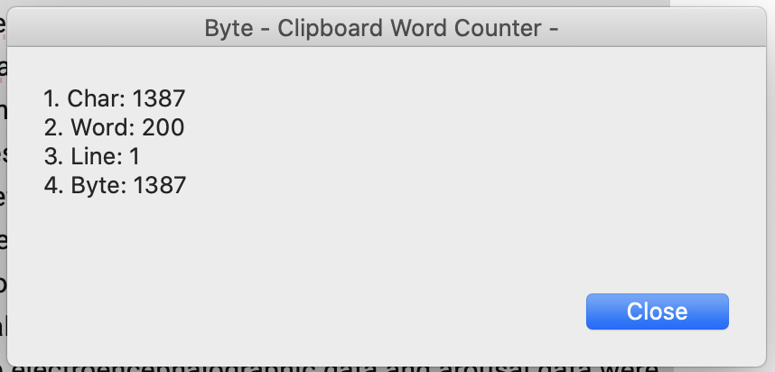

# Byte -Clipboard Word Counter-
=====

## Description

"Byte" is an application that counts the words that are in the clipboard. 

It is a super-fast application because it is written in a shell script.

(This application is only for macOS users.)

## Usage

1. Download `Byte.zip` and unzip in your local directory.
2. Move the `Byte.app` to `/Applications` directory.
3. Copy any words and open this application.
4. Number of **"Char / Word / Line / Byte"** will be displayed in a moment.
5. Press the "Close" button or "Enter" key to close the application.

## Author

- [1. Portfolio](https://www.umi-mori.jp/)
- [2. Twitter](https://twitter.com/umi_mori_jp)
- [3. LinkedIn](https://www.linkedin.com/in/masumi-morishige/)

